# Intercompany transfers

## Tabla de Contenidos

- [Decisiones de diseño](#decisiones-de-diseño)
  - [Modelado consultas](#modelado-consultas)
  - [Aspectos omitidos](#aspectos-omitidos)
- [Documentación](#documentación)
  - [OpenAPI (Swagger)](#openapi-swagger)
  - [Input/Output Lambda](#inputoutput-lambda)
- [Ejecución API](#ejecución-api)

## Enunciado _Challenge_

[La descripción del desafío se encuentra aquí](challenge.md)

## Decisiones de diseño

- Tanto para la estructura de carpetas como el diseño de la aplicación aplican la Arquitectura Hexagonal.
  - `application/`:
    - `domain/`: contiene las entidades de dominio, tipos de datos, value objects y errores
    - `ports/`: definición de interfaces para los actores que inicien la interacción con la aplicación(`in/`) o son iniciados por la misma (`out/`)
    - `services/`: clases encargadas de orquestar la funcionalidad.
  - `infrastructure/`:
    - `adapters`: componentes que interactúan entre la lógica central de la aplicación y el _mundo exterior_ (en este caso **requests HTTP** y persistencia en **base de datos**)
- Se identificaron las siguientes entidades:
  - Empresa (`Company`)
    - Con los atributos nombre (`name`), tipo (`type`) y fecha de adhesión (`subscriptionDate`). Sobre el último campo se tomó la decisión de permitir al cliente ingresar el valor, esto es, que la adhesión no necesariamente sea en el momento de la creación en la aplicación.
  - Transferencia (`Transfer`)
    - Cuenta con los atributos fecha de envío (`sentDate`), total (`amount`), empresa emisora (`senderCompany`) y empresa receptora (`recipientCompany`). Para la creación de una transferencia, el `DTO` (`CreateTransferDto`) recibe únicamente los `ids` de las empresa, y es la aplicación en el `TransfersService` posee la lógica de negocio validando que ambas empresa existan, de esta forma podemos crear transferencias para tener información para responder la consulta de **las empresas que realizaron transferencias en el último mes**.
- Persistencia: se optó por una instancia de `SQLite`

### Modelado consultas

- Para resolver **la consulta de las empresas que se adhirieron en el último mes**, se tomó la definición de exponer un contrato que reciba dos fechas como ventana de tiempo, donde el parámetro `from-date` es obligatorio, mientras que `to-date`, opcional. De esta forma, para responder la consulta planteada, el request sería `GET {host}/v1/companies/subscriptions?from-date=2025-07-25` (siendo hoy 2025-08-25).
- Para **la consulta de las empresas que realizaron transferencias en el último mes**, reutilizó el contrato de la ruta anterior, de esta forma se evita la duplicación de código, extendiendo la funcionalidad existente. Una ruta ejemplo que responde esta consulta es `GET {host}/v1/companies/transfers?from-date=2025-07-25`

### Aspectos omitidos

En esta versión inicial, se decidió prescindir de algunas validaciones a fin de priorizar los elementos esenciales que permitieran cumplir con el alcance definido. Estas son:

- Validaciones encapsuladas mediante la creación de _value objects_, por ejemplo:
  - En cadenas de texto, como el nombre de Empresa, no permitir cadenas vacías.
  - En valores numéricos, como el monto de una transferencia, no permitir valores negativos.
- Validaciones de negocio:
  - No permitir que la fecha de adhesión de una Empresa esa en el futuro.
  - No permitir que la fecha de envío de una Transferencia sea menor que la adhesión de cualquiera de las Empresas.
- Fue omitido en esta etapa el manejo de errores de la capa de persistencia.
- No fue incorporado un modelo de paginación para las rutas de consulta.

En algunos casos, las validaciones se encuentran en la capa de infraestructura (DTOs con `class-transformer`) ya que se favoreció la documentación del Swagger.

## Documentación

### OpenAPI (Swagger)

La documentación de los distintos endpoints de la aplicación se encuentra disponible en la ruta `{host}/docs`

### Input/Output Lambda

_Input esperado (happy path):_

```json
{
  "httpMethod": "POST",
  "path": "/adhesions",
  "headers": {
    "Content-Type": "application/json",
    "Accept": "application/json"
  },
  "body": "{\"name\":\"Monsters, Inc.\",\"type\":\"Corporativa\",\"subscriptionDate\":\"1973-08-25T13:47:24.108Z\"}"
}
```

_Posibles outputs:_

- 201 Created:

```json
{
  "statusCode": 201,
  "headers": {
    "Content-Type": "application/json",
    "X-Request-ID": "6f6e1a1b-6c52-41bd-b0a0-0d6c0c7c8b79"
  },
  "body": "{\"id\":\"f379a26f-9827-433a-90e2-9b866434caf4\",\"name\":\"Monsters, Inc.\",\"type\":\"Corporativa\",\"subscriptionDate\":\"1973-08-25T13:47:24.108Z\"}"
}
```

- 400 Bad Request (formato invalido de JSON o errores de validación)

```json
{
  "statusCode": 400,
  "headers": {
    "Content-Type": "application/json"
    "X-Request-ID": "6f6e1a1b-6c52-41bd-b0a0-0d6c0c7c8b79"
  },
  "body": "{\"success\":false,\"error\":{\"code\":\"INVALID_JSON\",\"message\":\"The request body is not valid JSON\"}}"
}
```

- 500 Internal Server Error

```json
{
  "statusCode": 500,
  "headers": {
    "Content-Type": "application/json"
    "X-Request-ID": "6f6e1a1b-6c52-41bd-b0a0-0d6c0c7c8b79"
  },
  "body": "{\"success\":false,\"error\":{\"code\":\"INTERNAL_ERROR\",\"message\":\"Internal server error\"}}"
}
```

**Diagrama**



Integrando la lambda al circuito como se muestra en el diagrama anterior, el circuito es:

1. El cliente realiza el request HTTP al AWS API Gateway.
2. Éste componente inicia la ejecución del handler de la lambda, definido en [`lambda/src/company-subscription/handler.ts`](lambda/src/company-subscription/handler.ts).
3. Se valida internamente el request y envía un nuevo request HTTP hacia la API desarrollada (POST /v1/companies)
4. Se deshace el camino anterior con la respuesta de la API hasta el cliente.

## Ejecución API

Crear archivo `.env` (`$ cp .env.example .env`)

- Instalar dependencias: `$ npm i`
- Modo desarrollo: `$ npm run start:dev`
- O productiva: `$ npm run build && node dist/main`

### Migraciones

Tras cada modificación en el modelo de datos, definido en el archivo `schema.prisma`, crear una migración mediante `npx prisma migrate dev --name <nombre-migracion>`

### Database seeding

El comando `$  npm run db:seed` genera valores iniciales para las tablas.
